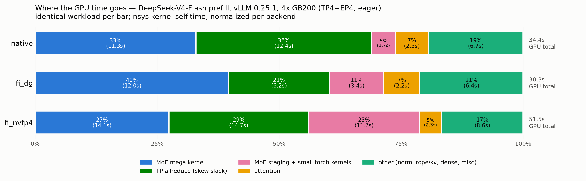

# vLLM e2e run log — DeepSeek-V4-Flash, native dg vs flashinfer moe_ep

All vLLM 0.25.1 end-to-end runs (2026-07-15), one place. Analysis lives in
`FINDINGS.md`, reproduce steps in `RUNBOOK.md`. The flashinfer kernel-level
sweeps stay in the flashinfer repo's `cutedsl_megamoe/TUNING.md` (unchanged —
that document is kernel-microbench scope; this one is vLLM e2e scope).

Setup for every run: DeepSeek-V4-Flash (hidden 4096 / moe-inter 2048 /
256 experts / top-6 / 43 MoE layers, fp4 experts + ue8m0-32 scales),
4x GB200, TP=4 + EP=4, eager mode, kv fp8, block 256,
max_num_batched_tokens 4096. Backends: **native** = vLLM `deep_gemm_mega_moe`
unmodified; **fi_dg** = flashinfer moe_ep, `deep_gemm_mega` kernel;
**fi_nvfp4** = flashinfer moe_ep, `nvfp4_cutedsl` kernel (checkpoint fp4
dequantized to bf16 at load, requantized nvfp4).

## Where the GPU time goes (nsys, prefill 1024-tok prompts, per-backend 100%)

Buckets from `results/nsys_20260715_225236_*_cuda_gpu_kern_sum.csv` (GPU
kernel self-time; identical workload, 64 prompts x warmup+2 rounds).
`staging+small` = MoE staging/quant + small torch kernels
(elementwise/copy/reduce/index).

(Regenerate with `python make_time_attribution_chart.py`; "other" folds
mhc/norm 1.5s + rope/kv ~1.3s + dense/sampler/misc.)

How to read it (details in FINDINGS.md "nsys attribution"):

- **MoE mega kernel**: per-launch avg native dg 1176 µs / fi_dg 1297 µs
  (same kernel — delta is inter-rank launch skew) / fi_nvfp4 cutedsl
  **1464 µs** → the cutedsl kernel is ~25% slower than dg at THIS geometry
  (4096-hidden/top-6; the microbench win was at 7168-hidden/top-8).
- **staging+small** grows 1.7s → 3.4s → 11.7s across native → fi_dg →
  fi_nvfp4: native stages with ONE fused kernel; fi_dg with
  `per_token_cast_to_fp8`+copies; fi_nvfp4 with ~98 small torch kernels per
  layer-step. cudaLaunchKernel counts: 100k / 330k / 946k.
- **allreduce** swings are skew absorption (whoever arrives last spins), not
  real collective cost — treat as slack, not work.
- fi_dg has LESS total GPU work than native yet lower e2e throughput →
  host-gap-bound (the staging launch storm stalls the GPU).

## Definitive throughput (offline repeat matrix, prefix caching OFF)

`bench_offline.py`: one engine boot per cell, 5 timed rounds after warmup,
round spread < 3%. fi wrapper with fast path + shared workspace.
JSONs: `results/offline_20260715_221930_*.json`.

| tok/s (median) | native | fi_dg | fi_nvfp4 (default knobs) | fi_nvfp4 (`KNOBS=auto`) |
|---|---|---|---|---|
| prefill 1024/1 | 31777 | 28350 (0.89x) | 25843 (0.81x) | 22348 (0.70x) |
| decode 128/256 | 1681 | 1421 (0.85x) | 1318 (0.78x) | 1154 (0.69x) |

**knobs=auto paradox:** the autotuner's winner (ikr + mma 256x256 +
flag_batch 8 + standalone_warps) measured **710 µs** in its own harness vs
1464 µs default / 1176 µs dg — a 2x kernel-level win — yet e2e got ~13%
WORSE on both workloads. The tuner's metric (synchronized collective
launches, median of max-across-ranks) does not transfer to the pipelined
engine; suspects: ikr's cross-rank atomics under real skew, and a possible
interaction with the shared-workspace patch binding buffers before the
knob switch (auto+sharedws correctness smoke: run 15). Also: auto re-tunes
per encountered shape (24 cute.compiles each, 576+ candidate timings in the
decode engine) — unusable in-engine; production should pin an
e2e-validated knob dict via `FI_MOE_EP_KNOBS='{...}'`.

## Correctness (greedy 64 tok x 8 prompts, per-token logprobs)

| comparison | exact | mean \|dlogprob\| |
|---|---|---|
| native vs native rerun | 8/8 | 0.0000 |
| native vs fi_dg | 3/8 | 0.01-0.06 |
| fi_dg vs fi_dg rerun | 2/8 | 0.01-0.08 (nondeterministic — open) |
| native vs fi_dg (fast-path+sharedws wrapper) | 3/8 | ~0.04 (unchanged) |
| native vs fi_nvfp4 | 1/8 | 0.02-0.20 (double-quant, expected) |

## Chronological run log

| # | run | node/job | config | result | artifact |
|---|---|---|---|---|---|
| 1 | smoke native (3 attempts) | 2387842 | FI=0 | dep-stack fixes (quack/dsl/tvm-ffi/tilelang), then PASS | logs/smoke_native.log |
| 2 | smoke fi_dg (3 attempts) | 2387842 | fi deep_gemm_mega | LOCAL_RANK device bug found+fixed, then PASS | logs/smoke_fi_dg.log |
| 3 | native rerun control | 2387842 | FI=0 | 8/8 bit-exact | results/smoke_native2.json |
| 4 | fi_dg rerun control | 2387842 | fi dg | 2/8 vs itself — nondeterminism found | results/smoke_fi_dg2.json |
| 5 | vllm-bench sweep r1 | 2387842 | 3 workloads x native,fi_dg | superseded (restart variance; output-len quirk) | results/bench_20260715_205636.csv |
| 6 | vllm-bench repeats r2-r4 | both | prefill/decode/mixed | prefill ±35% variance discovered | results/bench_20260715_21*.csv |
| 7 | smoke fi_nvfp4 (2 attempts) | 2388721 | fi nvfp4_cutedsl | weight-pack retention OOM found+fixed, then PASS | logs/smoke_fi_nvfp4.log |
| 8 | vllm-bench fi_nvfp4 | 2388721 | 3 workloads | superseded (one run raced a duplicate engine) | results/bench_20260715_2149*.csv |
| 9 | offline matrix v1 | 2388721 | fast-path wrapper | DISCARDED — prefix-cache hits faked 91k tok/s | logs/offline_matrix.log |
| 10 | offline matrix v2 | 2388721 | + prefix caching off, shared workspace | DEFINITIVE table above | results/offline_20260715_221930_*.json |
| 11 | smoke fi_dg fast-path | 2389111 | optimized wrapper | correctness unchanged | results/smoke_fi_dg_fast.json |
| 12 | nsys profile matrix | 2389111 | 3 backends, prefill | attribution chart above | results/nsys_20260715_225236_* |
| 13 | offline fi_nvfp4 knobs=auto | 2389111 | FI_MOE_EP_KNOBS=auto | kernel 710us win, e2e 13% LOSS (see paradox note) | results/offline_20260715_231848_fi_nvfp4_*.json |
| 14 | 4.5.2 DSL sensitivity (microbench, same day) | — | kernel-level, TUNING.md | 4.6.1 = perf floor (34-54% slower on 4.5.2) | flashinfer TUNING.md |
| 15 | smoke fi_nvfp4 knobs=auto | 2389111 | auto+sharedws correctness | *running* | logs/smoke_nvfp4_auto.log |

## Open items / next-run plan

1. **[next run] DP4/TP1+EP topology** (old `run_deepseek_v4_flash.sh` serve
   config): eliminates the per-layer TP allreduce entirely (21-36% of GPU
   time in the nsys profile, plus its skew noise) — attention goes
   data-parallel, cross-rank traffic collapses into the mega kernel's own
   dispatch/combine. Run all backends under `vllm serve` + `vllm bench
   serve` for TTFT/TPOT too.
2. **[next run] Wire the cutedsl backend's own fused staging+quant kernels**
   (kernel-repo frontend `quantize_input=True` path) instead of the generic
   torch staging the wrapper currently gets — kills the 98-launches/layer-
   step soup (23% of fi_nvfp4 GPU time) AND gives fixed-address staging so
   the launch-kwargs cache hits on vLLM's fresh per-step tensors.
3. cutedsl kernel retune at (4096, 2048, 256, top6): knobs=auto (run 13)
   restored the kernel win (710us vs dg 1176us) but LOST e2e at prefill —
   tuner-harness vs pipelined-e2e mismatch; needs kernel-repo sweep at this
   geometry + e2e-validated profiles, and a correctness smoke for the
   auto+shared-workspace combination.
4. Fuse fi_dg staging into one kernel writing symm buffers (native parity).
5. fi_dg run-to-run nondeterminism root cause.
6. CUDA-graph compatibility of the fi path.
